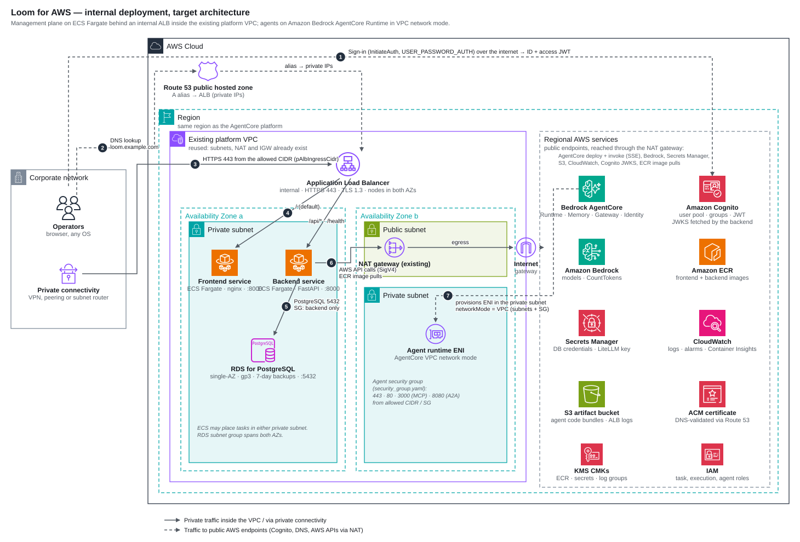
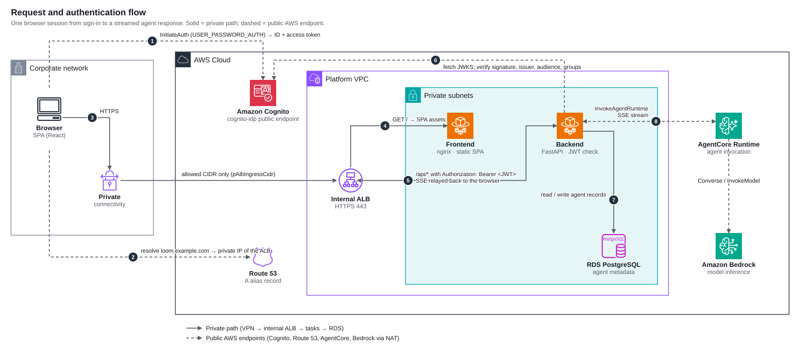
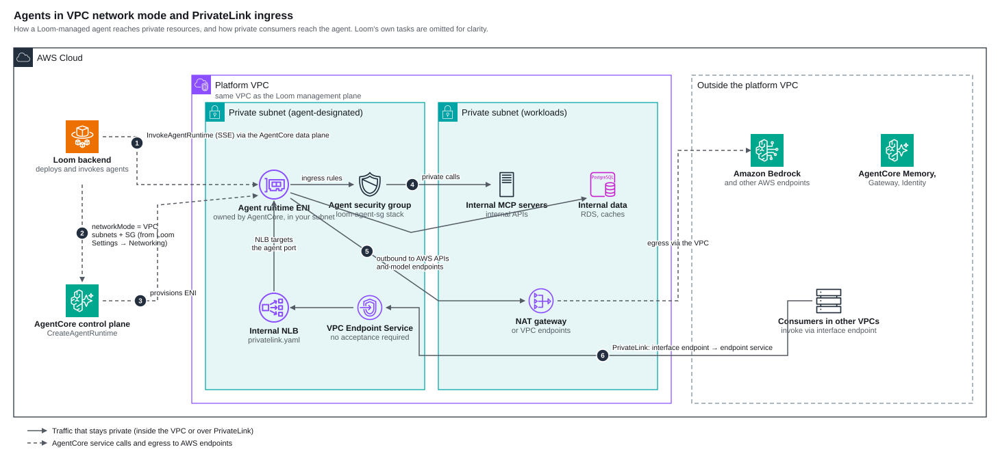
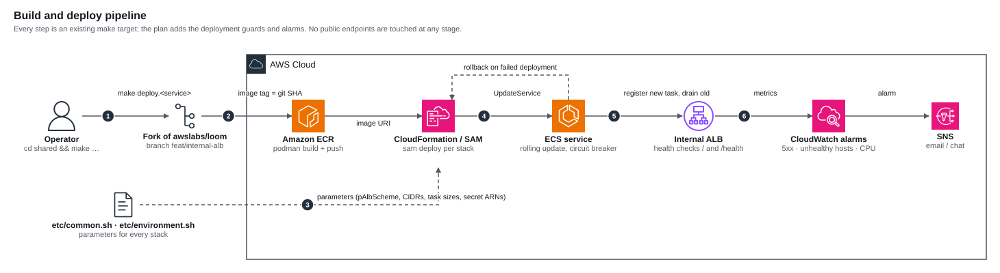

# Loom internal deployment — design

| | |
|---|---|
| Status | Draft for review |
| Date | 2026-09-12 |
| Scope | Running the Loom management plane privately, production-grade, at a small-team budget |
| Companion | [PLAN.md](PLAN.md) (implementation plan), [diagrams/](diagrams/) (AWS architecture diagrams) |

## 1. Summary

Loom's shipped Phase 3 topology (internet-facing ALB, three backend tasks, Multi-AZ RDS with RDS Proxy, EC2 bastion) is sized for a public, multi-team deployment and costs roughly $265 a month. This design keeps the same building blocks and the same CloudFormation/SAM stacks, but:

- makes the ALB **internal** (selectable via the new `pAlbScheme` parameter) and reuses the existing platform VPC, so the management UI is reachable only over private connectivity;
- runs **one backend task and one frontend task** on on-demand Fargate, with deployment guards (circuit breaker, rollback, alarms) that upstream does not ship;
- uses a **single-AZ RDS for PostgreSQL** instance with 7-day automated backups and deletion protection, and no RDS Proxy;
- drops the EC2 bastion in favour of ECS Exec;
- keeps agents on **Amazon Bedrock AgentCore Runtime in VPC network mode**, so agents reach VPC-internal resources through the same subnets.

Expected run cost is about $70 to $75 a month when the existing NAT gateway is reused, or $105 to $110 with a dedicated one. Model and AgentCore usage is billed separately and is not affected by this design.

## 2. Goals and non-goals

**Goals**

1. No public entry point to the Loom UI or API. All operator traffic enters through private connectivity and an internal ALB.
2. Stable enough for daily internal use: safe deploys, automatic rollback, alarms, tested backups, documented restore.
3. Minimal spend consistent with goals 1 and 2. Every cut is justified in §10.
4. Stay a thin fork of `awslabs/loom`: parameters and additive templates, no structural rewrites, so upstream can be merged regularly.
5. Agents deployed from Loom can reach private resources (internal MCP servers, databases) without leaving the VPC.

**Non-goals**

- High availability across AZs for the management plane. A single-task outage is tolerated for minutes.
- Multi-region, multi-account, or multi-tenant operation.
- Replacing Loom's data model, auth model, or UI.
- Public agent endpoints. Agents invoked from outside the VPC go through PrivateLink or the AgentCore data plane with IAM/OAuth, unchanged from upstream.

## 3. Context and constraints

- **What Loom is.** A control plane for building, deploying, and operating agents on Bedrock AgentCore. Agents keep running whether or not the Loom UI is up. Loom's database holds metadata (agent records, MCP/A2A registrations, settings), not agent state.
- **Where it runs.** The AgentCore platform already has a VPC (`10.0.0.0/16`, us-west-2) with two public and two private subnets across two AZs, a NAT gateway in one public subnet, and an internet gateway. **Confirmed 2026-09-12:** both private subnets route `0.0.0.0/0` to the NAT gateway, so they qualify for the ALB, the tasks, RDS and agent ENIs without any network change. This design deploys Loom into that VPC and region. Resource IDs are referenced by parameter from the local, gitignored env files; none are hardcoded in the fork.
- **Who uses it.** A small number of operators. Cognito's free tier covers this many times over.
- **Upstream facts the design relies on** (verified against the fork at the commit that added `pAlbScheme`):
  - Both containers listen on port 8000. The ALB routes `/api/*` and `/health` to the backend target group (rule priority 1) and everything else to the frontend.
  - The frontend authenticates against the Cognito `cognito-idp` public endpoint directly from the browser (`InitiateAuth`, `USER_PASSWORD_AUTH`). The backend verifies the JWT on every API call.
  - The backend talks to AWS APIs over the public endpoints: AgentCore control and data planes, Bedrock, Secrets Manager, S3, CloudWatch Logs, Cognito, IAM, CloudFormation, ECR, Agent Registry. Private subnets therefore need NAT (or a long list of VPC endpoints).
  - Both ECS services pin `LaunchType: FARGATE`, so they run on on-demand capacity regardless of the cluster's Spot default.
  - Upstream ships no CloudWatch alarms, no ECS deployment circuit breaker, and RDS `DeletionProtection: false`.
  - The frontend service runs in public subnets with public IPs assigned; the backend runs in private subnets without.
  - The backend receives `LOOM_DATABASE_URL` from the `database-url` secret created by the RDS stack; that secret already uses the instance endpoint when the proxy is disabled, so no env change is needed for the no-proxy setup.
  - The Cognito stack always creates its demo users; there is no parameter to skip them.
  - The RDS template only allows `db.t3.*` instance classes.

## 4. Architecture

Numbered flows in the diagram: (1) browser signs in against Cognito over the internet and receives ID and access tokens; (2) the browser resolves the Loom hostname through the public hosted zone and gets the ALB's private IPs; (3) HTTPS reaches the internal ALB over private connectivity, restricted by `pAlbIngressCidr`; (4) the ALB routes by path to the frontend or backend task; (5) the backend uses RDS over 5432; (6) the backend calls AWS APIs through the NAT gateway; (7) AgentCore provisions an ENI in the private subnet for every agent deployed in VPC network mode.

### 4.1 Components

| Component | Stack (template) | This design | Upstream default |
|---|---|---|---|
| Route 53 hosted zone | `loom-dns` (`shared/iac/dns.yaml`) | Public zone for the Loom subdomain; alias resolves to private IPs | same |
| ACM certificate | `loom-infra` (`shared/iac/infra.yaml`) | DNS-validated through the public zone | same |
| Application Load Balancer | `loom-infra` | `pAlbScheme=internal`, placed in the two private subnets, HTTPS 443 only, TLS 1.3 policy, access logs to the logging bucket, 300 s idle timeout for SSE | `internet-facing` in public subnets |
| ALB security group | `loom-infra` | Ingress 443 from `pAlbIngressCidr` (VPC or corporate CIDR) | ingress from an operator-supplied CIDR |
| ECS security group | `loom-infra` | Ingress 8000 from the ALB security group only | same |
| ECR repositories + KMS key | `loom-infra` | Two repos, scan on push, keep last 10 images | same |
| S3 artifact bucket | `loom-infra` | Versioned, encrypted, access-logged; holds agent code bundles | same |
| Cognito user pool | `loom-cognito` (`shared/iac/cognito.yaml`) | One pool, two app clients, 12 groups (`t-admin`, `t-user`, `g-*`); demo users not created (`pCreateDemoUsers=false`, fork change) | same, demo users always created |
| ECS cluster | `loom-ecs-cluster` (`shared/iac/ecs.yaml`) | Container Insights on | same |
| RDS for PostgreSQL | `loom-rds` (`backend/iac/rds.yaml`) | `db.t3.micro`, single-AZ, gp3, encrypted, IAM auth on, 7-day backups, deletion protection **on**, no RDS Proxy | `db.t3.small`, Multi-AZ optional, Proxy on |
| Backend service | `backend/iac/ecs.yaml` | 1 task, 0.5 vCPU / 1 GB, on-demand Fargate, private subnets, circuit breaker + rollback, ECS Exec enabled | 3 tasks, 1 vCPU / 2 GB, autoscaling on CPU |
| Frontend service | `frontend/iac/ecs.yaml` | 1 task, 0.25 vCPU / 0.5 GB, **private subnets, no public IP** | 2 tasks, public subnets, public IP |
| CloudWatch | task log groups (KMS-encrypted, 30-day retention) + **new alarms stack** | 5xx, unhealthy targets, task count, CPU/memory, RDS storage and CPU → SNS | log groups only |
| EC2 bastion | `loom-ec2` (`backend/iac/ec2.yaml`) | **Not deployed.** ECS Exec into the backend task replaces it | deployed for SSM tunnel |
| Agent security group | `loom-agent-sg` (`shared/iac/security_group.yaml`) | Deployed; referenced by the VPC config profile in Loom Settings | optional |
| PrivateLink ingress | `shared/iac/privatelink.yaml` | Optional; only if consumers in other VPCs must invoke agents privately | optional |

### 4.2 What changes in the fork

All changes are parameters, defaults, or additive templates. See PLAN.md phase 1 for the task list.

| Change | Why |
|---|---|
| `pAlbScheme` parameter on the ALB, default `internal` (done) | Internal posture with one switch; upstream behaviour recoverable by setting `internet-facing` |
| Frontend service to private subnets, `AssignPublicIp: DISABLED` | The frontend has no reason to hold a public IP; matches the backend |
| ECS `DeploymentConfiguration` with `DeploymentCircuitBreaker` (enable + rollback), `MinimumHealthyPercent: 100`, `MaximumPercent: 200` | A single-task service can deploy without downtime only if the new task starts before the old one stops, and a broken image must roll back rather than stay broken |
| `EnableExecuteCommand: true` + SSM permissions on the task role | Replaces the bastion for occasional DB access and debugging |
| RDS `DeletionProtection` as a parameter, default `true` | Upstream hardcodes false |
| New `shared/iac/alarms.yaml` (SNS topic + alarms) | Upstream has no alarms; "stable" needs them |
| `pCreateDemoUsers` condition on `shared/iac/cognito.yaml`, default `false` | Upstream always creates 22 demo users; a production pool should not have them |
| `[optional]` add `db.t4g.*` to the RDS instance class allowed values | Graviton classes are about 10 % cheaper; not required |

## 5. Network design

### 5.1 Placement

| Tier | Subnets | Public IP | Ingress | Egress |
|---|---|---|---|---|
| ALB (internal) | 2 private subnets, 2 AZs (ALB requirement) | none | 443 from `pAlbIngressCidr` | to ECS SG on 8000 |
| Frontend + backend tasks | private subnets | none | 8000 from ALB SG | NAT gateway → AWS public endpoints |
| RDS | private subnets (subnet group across both AZs) | none | 5432 from backend task SG | none |
| Agent runtime ENIs | private subnets designated for agents | none | per `loom-agent-sg` (443, 80, 3000, 8080 from allowed CIDR/SG) | NAT gateway (AgentCore VPC mode routes all agent egress through the VPC) |

The ALB parameter is still named `pPublicSubnetIds` in upstream; in this design it is fed the private subnet IDs. The name is kept to avoid touching every makefile and env file.

### 5.2 Why NAT, not VPC endpoints, and why not public IPs

- Putting the backend on public IPs to avoid NAT contradicts the internal posture: the backend holds the credentials that deploy agents. Rejected.
- Interface endpoints for the services the backend uses (ECR API, ECR DKR, CloudWatch Logs, Secrets Manager, Bedrock, Bedrock AgentCore, STS, Cognito, plus S3 gateway) cost about $7.30 each per month per AZ. Six or more endpoints cost more than one NAT gateway and still would not cover every API the backend calls.
- The platform VPC already has a NAT gateway. Reusing it makes the NAT cost for Loom zero. If Loom must live in its own VPC, budget $33 a month plus data for a NAT gateway.

### 5.3 Reaching an internal ALB

The internal ALB is only useful if operators have a path into the VPC. This is the one cost upstream never mentions.

| Option | Monthly | Notes |
|---|---|---|
| Existing corporate VPN / Direct Connect / peering | $0 extra | Preferred if it already exists. Set `pAlbIngressCidr` to the corporate range. |
| Tailscale (or similar) subnet router on a `t4g.nano` in a private subnet | ~$3 | Advertises the VPC CIDR to the tailnet. Self-managed instance, SSM-managed patches. |
| AWS Client VPN | $75+ | Endpoint association per hour plus per-connection hours. More than the ALB and RDS combined. Not recommended at this scale. |
| Internet-facing ALB locked to known IPs + Cognito | $0 | Defensible for a small team with fixed egress IPs. Available by setting `pAlbScheme=internet-facing`. Not the default in this design. |

**Confirmed 2026-09-12:** operators already use a VPN server, and it runs **outside AWS** (no VPN endpoint, connection, or instance exists in the platform account). A VPN server outside the VPC cannot reach the internal ALB by itself. Two ways to close the gap:

- **Site-to-Site VPN** from that server (or its router) to a virtual private gateway or transit gateway on the platform VPC: about $36 a month for the AWS side, IPsec, no new instance. Clients keep their current VPN; the VPN server routes the VPC CIDR over the tunnel.
- **Move or mirror the VPN server into the VPC** (a small instance in a public subnet running the same WireGuard/OpenVPN/Tailscale software): about $3 to $8 a month, one more host to patch.

Either way `pAlbIngressCidr` is the VPN client range (or the VPC CIDR if the tunnel NATs). Decide in PLAN.md phase 0; the subnet router remains the fallback. See PLAN.md phase 5.

### 5.4 DNS and TLS

- **Confirmed 2026-09-12:** the hostname is `loom.visusops.com`; the parent zone `visusops.com` is hosted at **Cloudflare**. The existing `mcp.visusops.com` uses a different pattern (a *private* Route 53 zone associated with the VPC, alias to an API Gateway VPC endpoint, ACM validated by a CNAME placed in Cloudflare). For Loom the recommended pattern is upstream's: create the public zone with `loom-dns`, then add the four **NS records for `loom`** in Cloudflare (DNS only, not proxied). ACM then validates and renews automatically through Route 53, and VPN clients resolve the name with any resolver. The mcp pattern (private zone + Cloudflare-validated certificate) would need two fork changes (an optional `pCertificateArn` on `infra.yaml`, a private zone in `dns.yaml`) and requires the VPN to push the VPC resolver to clients; it is not recommended for Loom.
- The Route 53 hosted zone stays **public** because ACM DNS validation needs a publicly resolvable CNAME. The A record is an alias to the internal ALB, so it resolves to private IPs. That leaks the existence of the hostname and private IPs, which is acceptable for an internal tool; it does not expose a service.
- If leaking is unacceptable, use a private hosted zone associated with the VPC for the A record and keep the public zone only for ACM validation. This is a small change to `dns.yaml`/`infra.yaml` and is listed as optional in the plan.
- TLS terminates on the ALB with the ACM certificate and the `ELBSecurityPolicy-TLS13-1-2-2021-06` policy. Tasks speak plain HTTP on 8000 inside the VPC.

## 6. Request and authentication flow

1. The SPA calls Cognito's `cognito-idp` endpoint directly from the browser and receives ID and access tokens. This is a public AWS endpoint; the client device needs internet access even though the app itself is internal.
2. The browser resolves the Loom hostname and gets the internal ALB's private IPs.
3. Over private connectivity the browser opens HTTPS to the ALB. The ALB security group admits only `pAlbIngressCidr`.
4. The ALB serves `/` from the frontend task (static SPA behind nginx).
5. API calls go to `/api/*` with `Authorization: Bearer <JWT>`; the ALB forwards them to the backend task.
6. The backend fetches Cognito's JWKS (cached) and verifies signature, issuer, audience, and group claims. Group membership drives Loom's persona and scope model.
7. The backend reads and writes agent metadata in RDS.
8. Agent invocations call the AgentCore Runtime data plane and stream SSE chunks back through the backend and the ALB to the browser. The ALB idle timeout is 300 s to keep long streams open.

## 7. Data

| Store | Contents | Protection | RPO / RTO |
|---|---|---|---|
| RDS for PostgreSQL | agent, MCP, A2A, memory, registry records; settings; VPC config profiles | encrypted (KMS), IAM auth, not publicly accessible, deletion protection, automated backups 7 days with 5-minute PITR granularity | RPO ≤ 5 min; RTO ≈ 20–30 min (restore to a new instance, update the `database-url` secret to its endpoint, redeploy the backend) |
| S3 artifact bucket | agent code bundles uploaded at deploy time | versioned, SSE-S3, public access blocked, access-logged, old versions expire after 90 days | versioned; a deleted bundle is recoverable for 90 days |
| Secrets Manager | RDS credentials, RDS master secret, LiteLLM key (if used) | KMS CMK, backend execution role read-only to named ARNs | n/a |
| CloudWatch Logs | task logs (30 days), agent runtime logs | KMS-encrypted log groups | n/a |
| Cognito | users, groups | managed | export users on a schedule if the pool must be rebuildable |

Single-AZ RDS is the deliberate trade: Multi-AZ doubles the instance cost to protect against an AZ failure that would also take down the single backend task. The backup/restore path above is tested once in PLAN.md phase 6 and documented as a runbook.

## 8. Agents in VPC network mode

- Loom creates the runtime with `networkMode: VPC` and the subnet and security group IDs from a named VPC config profile (Loom Settings → Networking). AgentCore then places an ENI it owns in the designated private subnet.
- The agent security group (`loom-agent-sg` stack) allows 443, 80, 3000 (MCP) and 8080 (A2A) from an allowed CIDR or source security group. Only rules with values are created.
- Inside the VPC the agent reaches internal MCP servers, internal APIs, and data stores directly. Its calls to Bedrock, AgentCore Memory/Gateway/Identity and other AWS APIs also leave through the VPC, so the agent subnets need the NAT route (or endpoints) too.
- Consumers in other VPCs can invoke an agent privately through PrivateLink: the `privatelink.yaml` stack creates an internal NLB with IP targets on the agent port and a VPC Endpoint Service with `AcceptanceRequired: false`. This is optional and owned by whoever runs the consuming VPC.
- Agent-to-Loom traffic does not exist: agents never call back into the Loom API.

## 9. Deployment

- Every step is an existing make target driven by `shared/etc/common.sh` and the per-component `environment.sh`. No new tooling.
- Images are built with podman and pushed to ECR tagged with the git SHA; the ECS task definition references the immutable tag.
- Stacks deploy in the upstream order: dns → cognito → infra → ecs-cluster → rds → agent-sg → alarms → backend → frontend. The `pAlbScheme`, CIDR, subnet and sizing parameters come from the env files.
- Service updates are rolling with `MinimumHealthyPercent: 100` and `MaximumPercent: 200`, so the new task must pass the ALB health check before the old task drains. The circuit breaker rolls back automatically on a failed deployment.
- Deploys are manual and reviewed. A CI job can call the same targets later without changing the design.

## 10. Sizing and cost

Estimates are on-demand, us-west-2, 730 h/month, excluding data transfer and excluding Bedrock/AgentCore usage. Round numbers; verify against the pricing calculator before committing budget.

| Item | Setting | ≈ $/month | Shipped default |
|---|---|---|---|
| Backend Fargate | 1 × 0.5 vCPU / 1 GB, on-demand | 18 | 3 × 1 vCPU / 2 GB ≈ 108 |
| Frontend Fargate | 1 × 0.25 vCPU / 0.5 GB | 9 | 2 × ≈ 18 |
| RDS PostgreSQL | db.t3.micro single-AZ, 20 GB gp3 | 15 | db.t3.small Multi-AZ + Proxy ≈ 75 |
| Internal ALB | fixed + LCU | 18 | 18 |
| NAT gateway | reused | 0 | 33 + data |
| Subnet router | t4g.nano | 3 | n/a |
| CloudWatch | logs, 6 alarms, Container Insights | 4 | 4 |
| KMS | 3 CMKs | 3 | 3 |
| Secrets Manager, Route 53, ECR, S3 | | 3 | 3 |
| EC2 bastion | not deployed | 0 | 8 |
| **Total** | | **≈ 73** | **≈ 270** |

With a dedicated NAT gateway add about $33 plus $0.045 per GB. Adding a second backend task for AZ resilience adds about $18.

Sizing rationale: the backend is I/O-bound (waiting on AWS APIs and SSE streams), so 0.5 vCPU / 1 GB is ample for a handful of concurrent operators; upstream's 1 vCPU / 2 GB is kept as the first thing to raise if memory alarms fire. `db.t3.micro` (1 GB) comfortably holds Loom's metadata tables; upgrade to `db.t3.small` if `FreeableMemory` alarms. Graviton `db.t4g` classes need the optional allowed-values change first.

## 11. Reliability and operations

**Failure modes and responses**

| Failure | Effect | Detection | Response |
|---|---|---|---|
| Backend task crashes | UI errors for ~1–2 min while ECS replaces the task | `HealthyHostCount < 1`, 5xx alarm | automatic; investigate logs |
| Bad backend image deployed | new task fails health check | circuit breaker | automatic rollback to the previous task definition |
| RDS instance failure | API unavailable | RDS `CPUUtilization`/`FreeStorageSpace`/connection alarms, 5xx | restore from automated backup to a new instance (runbook), repoint, redeploy |
| AZ outage (single-AZ RDS or task AZ) | outage until RDS is restored in the other AZ | alarms | restore runbook; agents keep running |
| NAT gateway or route loss | backend cannot reach AWS APIs; UI loads, actions fail | 5xx alarm, backend logs | platform network runbook |
| Private connectivity down | operators cannot reach the UI; nothing else affected | user report | fix VPN / subnet router |
| Certificate expiry | ACM renews automatically while the DNS validation record exists | ACM `DaysToExpiry` alarm (optional) | keep the CNAME |

**Alarms (new `alarms.yaml` stack, all → one SNS topic)**

- ALB `HTTPCode_Target_5XX_Count` ≥ 5 in 5 min
- ALB `UnHealthyHostCount` ≥ 1 for 5 min (per target group)
- ECS `RunningTaskCount` < desired for 5 min (backend, frontend)
- ECS CPU or memory > 80 % for 15 min (backend)
- RDS `FreeStorageSpace` < 2 GB, `CPUUtilization` > 80 % for 15 min, `DatabaseConnections` near the instance limit
- Optional: AWS Budgets alert at the agreed monthly figure

**Runbooks to write (PLAN.md phase 6)**: restore RDS from backup; roll back a deployment manually; rotate the RDS credential; ECS Exec into the backend; re-sync the fork with upstream.

## 12. Security

- **No public endpoints.** Internal ALB, tasks and RDS without public IPs, agents in VPC mode. The only public interactions are the browser's calls to Cognito and the backend's SigV4 calls to AWS APIs via NAT.
- **Ingress.** ALB security group admits only `pAlbIngressCidr`. ECS security group admits only the ALB. RDS security group admits only the backend task security group.
- **Identity.** Cognito user pool with groups mapped to Loom personas and scopes; JWT verified server-side on every request. Federation to Entra ID/Okta/OIDC is supported upstream if needed later.
- **Secrets.** Only Secrets Manager ARNs are passed to tasks; no secret values in env files under git. The fork's example env files contain placeholders only.
- **Least privilege.** Task role stays scoped to the services Loom needs (AgentCore, Bedrock, IAM PassRole for agent roles, S3 bucket, Secrets ARNs, Cognito pool, CloudFormation, ECR). Phase 8 reviews every `*` resource.
- **Encryption.** KMS CMKs for ECR, secrets, and log groups; RDS storage encrypted; S3 SSE.
- **Deletion safety.** RDS deletion protection on; S3 bucket retained on stack delete (upstream). Loom's own "delete agent" API defaults to leaving AWS resources in place; operators must tick cleanup. This is upstream behaviour and is documented in the runbook.
- **Supply chain.** ECR scan on push; images pinned by SHA tag.

## 13. Decisions

| # | Decision | Alternatives | Rationale |
|---|---|---|---|
| D1 | Internal ALB via `pAlbScheme` (default `internal`) | internet-facing + CIDR lock; API Gateway VPC link; single EC2 | Meets "no public endpoint" with a one-line template change; keeps upstream ECS/ALB templates intact |
| D2 | Reuse the platform VPC and NAT | Dedicated VPC | Saves $33+/month and keeps agents and Loom in one network; no isolation requirement exists |
| D3 | 1 backend task on-demand, with circuit breaker | 2 tasks; Spot | Spot reclaims kill SSE sessions; a second task buys AZ resilience the single-AZ DB does not have anyway |
| D4 | Single-AZ RDS, no Proxy, deletion protection on | Multi-AZ; Proxy | Metadata-only DB; backups give RPO ≤ 5 min; Proxy only pays off with many connections |
| D5 | Drop the bastion; use ECS Exec | Keep bastion | Bastion exists only for an SSM tunnel; ECS Exec covers it at zero cost |
| D6 | Keep the public hosted zone with a private-IP alias | Private hosted zone | ACM validation needs the public zone; hostname leak is acceptable; private zone listed as optional |
| D7 | Subnet router as the default access path | Client VPN; corporate VPN | Cheapest working path if no corporate VPN exists; replaceable without touching Loom |
| D8 | Alarms as a separate additive stack | Edit upstream ECS/RDS templates | Keeps the upstream diff small; alarms can be dropped or replaced independently |

## 14. Risks and open questions

- **Access path.** Whether a corporate VPN exists decides between D7's subnet router and $0. Confirm before phase 5.
- **AgentCore VPC mode egress.** Agent subnets must route to the NAT gateway; if they are isolated subnets, model calls fail. Verify the route table of the designated subnets.
- **Browser needs internet for Cognito.** Fully air-gapped clients cannot sign in. Acceptable for the intended users.
- **Upstream drift.** Upstream moves quickly (recent Integrations page, dependabot bumps). Merge upstream monthly; the fork's diff is small by design.
- **Loom's delete semantics.** `DELETE /api/agents/{id}` leaves AWS resources running unless cleanup is requested. Document and consider a cost-guard check.
- **Certificate validation on first deploy** requires the parent zone's NS delegation to be live before `loom-infra` can complete.
- **Lesson from `mcp.visusops.com`:** an ACM certificate validated by a CNAME that is later removed from Cloudflare cannot renew (observed: renewal `PENDING_VALIDATION`, expiry 2026-09-27). With NS delegation the validation record lives in Route 53 and is managed by the stack, so this cannot recur for Loom.

## 15. Alternatives considered

- **Run Loom locally, agents in AWS.** Zero-cost and already proven in the August evaluation. Rejected for the production requirement (shared, always-on UI), but remains the fallback and the development mode.
- **Single EC2 instance with docker compose and SQLite.** About $15 a month. Rejected: abandons the upstream templates, SQLite is single-writer, and it is harder to keep in sync with upstream.
- **Shipped Phase 3 as-is.** Rejected on cost (~$270) and on the public ALB.

## Appendix A. Parameter reference (changed or newly relevant)

| Variable (env) | Stack parameter | Value in this design |
|---|---|---|
| `PUBLIC_SUBNET_IDS` → `P_INFRA_PUBLIC_SUBNET_IDS` | `pPublicSubnetIds` | the two **private** subnet IDs (ALB placement) |
| `ALB_INGRESS_CIDR` → `P_INFRA_ALB_INGRESS_CIDR` | `pAlbIngressCidr` | VPC CIDR, or the VPN/tailnet range |
| `P_INFRA_ALB_SCHEME` | `pAlbScheme` | `internal` |
| `P_ECS_BACKEND_CPU` / `_MEMORY` / `_DESIRED_COUNT` | backend task size | `512` / `1024` / `1` |
| `P_ECS_FRONTEND_CPU` / `_MEMORY` / `_DESIRED_COUNT` | frontend task size | `256` / `512` / `1` |
| `P_ECS_PUBLIC_SUBNET_IDS` (frontend) | frontend subnets | private subnet IDs (after the phase 1 change) |
| RDS instance class | `pDbInstanceClass` | `db.t3.micro` |
| RDS Multi-AZ | `pDbMultiAZ` | `false` |
| RDS Proxy | `pEnableProxy` | `false` |
| RDS deletion protection | `pDeletionProtection` (new) | `true` |
| Cognito demo users | `pCreateDemoUsers` (new) | `false` |
| `LOOM_DATABASE_URL` | injected from the `database-url` secret | instance endpoint (automatic when `pEnableProxy=false`) |
